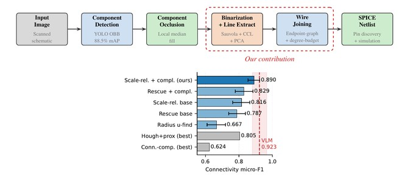

# Circuit Digitization: Hand-Drawn Schematics to SPICE Netlists

A deterministic pipeline that converts scanned, hand-drawn circuit schematics into
simulation-ready SPICE netlists. The pipeline runs component detection, an occlusion-first
wire extractor, an endpoint-graph join that resolves which terminals are electrically the same
net, and netlist emission — no learned connectivity model in the loop. Alongside the pipeline,
this repository publishes the first human-verified, net-level connectivity benchmark for
hand-drawn circuits (31 images from CGHD-1152), so connectivity accuracy can be measured
directly rather than inferred from downstream tasks.



## Paper

This repository contains the code and benchmark for:

> **From Hand-Drawn Schematics to SPICE Netlists: A Deterministic Pipeline with Endpoint-Graph
> Wire Joining and a Human-Verified Connectivity Benchmark.**
> Under review at IEEE Access (2026).

### How to cite

```bibtex
@article{chanam2026handdrawn,
  title   = {From Hand-Drawn Schematics to SPICE Netlists: A Deterministic Pipeline
             with Endpoint-Graph Wire Joining and a Human-Verified Connectivity Benchmark},
  author  = {Chanam, Bosco and Dcosta, Chris and Talupuri, Pranavesh Kumar and
             Chiwhane, Shwetambari and Singh, Ashay Kumar and Das, Arghadeep},
  year    = {2026},
  note    = {Under review at IEEE Access}
}
```

## Headline results

All connectivity numbers are micro-F1 on the 31-image human-verified net-level benchmark
(`ground_truth/real_nets_verified.json`), over identical detected wires unless noted. Full
provenance for every figure is in [`docs/research/experiments/SUMMARY.md`](docs/research/experiments/SUMMARY.md).

| Measurement | Score |
|---|---|
| Wire-detection F1 (134 CGHD scans) | 0.976 |
| Connectivity micro-F1 — ours (scale-relative base + completion) | 0.890 |
| Connectivity micro-F1 — prior completion default | 0.829 |
| Connectivity micro-F1 — Hough + proximity | 0.805 |
| Connectivity micro-F1 — radius union-find | 0.667 |
| Connectivity micro-F1 — connected-components net tracing | 0.624 |
| Connectivity micro-F1 — frontier VLM reference | 0.923 |
| Synthetic suite at maximum severity — ours vs. radius baseline | 0.95 vs. 0.36 |

The VLM reference (0.923) is statistically indistinguishable from our join: the paired
difference has a bootstrap 95% CI of [−0.009, +0.078], which includes zero, while costing two
to three orders of magnitude more per image and producing non-simulatable output. Running the
join on perfect wire labels leaves micro-F1 unchanged at 0.890, so connectivity — not wire
detection — is the remaining bottleneck.

## Quickstart

Requires Python >= 3.13 and [uv](https://docs.astral.sh/uv/).

```bash
uv venv && uv sync
```

Download the component-detection model weights (verifies SHA256 and installs into
`models/component_detection/`):

```bash
uv run scripts/download_model.py
```

This fetches `yolo26m_obb_16class_aug.pt` from
[huggingface.co/boscochanam/circuit-component-detector](https://huggingface.co/boscochanam/circuit-component-detector).

Run a zero-external-data synthetic demo (generates images and line labels, no dataset needed):

```bash
uv run wire-sdg --num-images 5 --output-dir data/synthetic_demo --seed 0
```

Real-image evaluation additionally needs the CGHD-1152 dataset — *A Public Ground-Truth Dataset
for Handwritten Circuit Diagram Images*, by Felix Thoma, Johannes Bayer, and Yakun Li (DFKI),
licensed [CC BY 4.0](https://creativecommons.org/licenses/by/4.0/) and archived at
[doi:10.5281/zenodo.6385814](https://doi.org/10.5281/zenodo.6385814). Mirror on Kaggle:
[kaggle.com/datasets/johannesbayer/cghd1152](https://www.kaggle.com/datasets/johannesbayer/cghd1152).

## Reproducing the paper

See [`docs/reproducing-the-paper.md`](docs/reproducing-the-paper.md) for the full walkthrough.
The key artifacts are:

- `ground_truth/real_nets_verified.json` — the 31-image human-verified net-level ground truth.
- `wire_detection/benchmark/` — evaluation scripts, including the join-strategy benchmarks,
  connected-component and Hough baselines, the detection ceiling, and bootstrap confidence
  intervals.
- `docs/research/experiments/*.json` — the committed result artifacts backing every headline
  number, indexed by [`docs/research/experiments/SUMMARY.md`](docs/research/experiments/SUMMARY.md).

## Command-line tools

Installed as console scripts by `uv sync`:

| Command | Description |
|---|---|
| `wire-pipeline` | Run the full pipeline on a single image |
| `wire-sdg` | Generate a synthetic wire dataset |
| `wire-eval` | Evaluate detections against ground truth |
| `wire-sweep` | Run a parameter sweep over the pipeline |
| `wire-tune` | Start the interactive tuner API server (FastAPI) |
| `wire-vlm` | VLM-based quality assessment (classify, sweep, audit) |
| `wire-benchmark-exp` | Run the wire-detection experiment harness |
| `wire-benchmark-quality` | Bridge CGHD quality-audit signals to benchmark performance |
| `wire-benchmark-learned` | Train the lightweight learned wire-mask branch |

Pass `--help` to any command for its arguments.

## Interactive tuner

A FastAPI backend plus a Next.js UI for stepping through images, inspecting detected topology,
hand-editing wire connections, and watching edits propagate into the netlist and simulation.

```bash
uv run wire-tune                  # backend API
cd ui && pnpm install && pnpm dev # UI on http://localhost:4200
```

See [`ui/README.md`](ui/README.md) for details.

## Project structure

```
wire_detection/     Python backend
  pipeline/         Single-image pipeline
  core/             Netlist, join strategies, join graph, SPICE, simulator, mapping
  benchmark/        Evaluation and baseline scripts
  sdg/  synthgt/    Synthetic data / ground-truth generators
  evaluate/  experiment/   Detection eval and parameter sweeps
  vlm/              VLM quality classifier
  api/              FastAPI routes
ui/                 Next.js tuner UI
ground_truth/       Human-verified net-level GT
models/             Component-detection weights (downloaded, gitignored)
docs/               MkDocs documentation and research logs
paper/ieee-paper/   IEEE Access manuscript source
```

## Documentation

Browse the docs locally:

```bash
uv run mkdocs serve
```

Source lives under [`docs/`](docs/). Historical research-log material from earlier revisions of
this README is archived in [`docs/research/readme-archive.md`](docs/research/readme-archive.md).

## Tests

```bash
uv run pytest wire_detection/tests/ -q
```

## License

Two licenses apply:

- **Source code, documentation, and net annotations** — MIT, see [`LICENSE.txt`](LICENSE.txt).
- **Overlay images** under `ground_truth/net_gt_ui_overlays/` — CC BY 4.0. They are adaptations
  of [CGHD-1152](https://doi.org/10.5281/zenodo.6385814) (Thoma, Bayer, and Li, DFKI) and remain
  under the source dataset's license. See [`ground_truth/LICENSE`](ground_truth/LICENSE) for the
  required attribution and a statement of the modifications made.

## Contact

- Chris Dcosta — chrisdcosta777@gmail.com / chris.dcosta.btech2021@sitpune.edu.in
- Repository — github.com/boscochanam/circuit-digitization
- Bosco Chanam — GitHub [@boscochanam](https://github.com/boscochanam)
</content>
