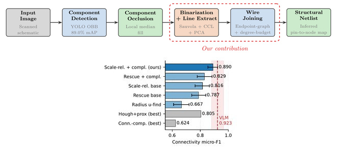

# Circuit Digitization: Hand-Drawn Schematics to Structural Circuit Netlists

A deterministic pipeline that recovers **structural** netlists (which component terminals share
an electrical node) from hand-drawn circuit schematics. It does not read component values or
device models; the SPICE-syntax export uses placeholder values and simulation of real scans is
not evaluated. The pipeline chains an OBB component detector, an occlusion-first wire extractor
that returns segments with explicit endpoints, a typed endpoint-graph join with scale-relative
tolerances, and degree-budget completion of floating pins. No learned connectivity model is in
the loop.

With annotated component boxes, the join reaches component-pair micro-F1 **0.884** on 31
CGHD-1152 images with human-verified nets (where its configuration was selected) and **0.711** on
164 held-out CGHD photographs from 24 of the corpus's 25 drafters, whose reference nets are
derived from the dataset's own stroke maps and symbol polygons. On both benchmarks it beats every
deterministic baseline in paired tests with Holm correction. End to end with the trained
component detector it scores **0.602**, and the largest share of that loss comes from missed components.



## Paper

> **From Hand-Drawn Schematics to Structural Circuit Netlists: A Deterministic Pipeline with
> Endpoint-Graph Wire Joining and a Human-Verified Connectivity Benchmark.**
> B. Chanam, C. Dcosta, P. K. Talupuri, S. Chiwhane, A. K. Singh, A. Das.
> Revised manuscript, IEEE Access (Access-2026-33821), 2026.

Source: [`paper/ieee-paper/paper-access.tex`](paper/ieee-paper/paper-access.tex). The resubmission
package (clean and highlighted PDFs, change index, response to reviewers, Overleaf zip) is in
`paper/ieee-paper/review_artifacts/submission/`.

## Headline results

Connectivity is component-pair micro-F1 (pairs of electrical components sharing a net, pooled
over images; macro-F1 reported alongside), with annotated component boxes and the pipeline's own
detected wires unless noted. Provenance for every number:
[`docs/research/experiments/SUMMARY.md`](docs/research/experiments/SUMMARY.md).

| Measurement | Human-verified (31) | Held-out (164) |
|---|---|---|
| **Ours** (scale-relative graph + completion) | **0.884** (P 0.895 / R 0.873) | **0.711** (P 0.766 / R 0.664) |
| Rescue graph + completion (prior default) | 0.814 | 0.659 |
| Scale-relative graph (base) | 0.812 | 0.595 |
| Hough + proximity | 0.782 | 0.480 |
| Radius union-find (legacy) | 0.645 | 0.518 |
| Connected components on detected wires | 0.597 | 0.594 |
| VLM reference (Claude Opus 4.8, same electrical boxes) | 0.946 | not run |

- **Significance.** Every margin over a deterministic baseline is significant after Holm
  correction on both benchmarks. The VLM is significantly better than ours: pooled −0.062, 95% CI
  [−0.110, −0.013] (Holm p = 0.015), and per image (16 wins vs 4, Wilcoxon Holm p = 0.006).
- **Labels.** In the 31-image nets a plain crossing (no dot) is not a connection and a wire ending
  on another wire is. Four images were corrected on 2026-10-05 (C112, C242, C66, C15); all numbers
  here use the corrected nets.
- **Held-out robustness.** Dropping the 25 images that overlap the wire benchmark gives 0.709
  (139 images). Under extended scoring conventions (more device types scored, switches closed,
  grounds merged) ours stays first (0.676–0.712).
- **Reference audit.** 40 held-out images drawn at random: the 3 densest excluded, the other 37
  all checked by a human. The derived reference scores micro-F1 0.999 against the audited nets,
  with no false pairs.
- **End to end** with the trained detector (conf 0.5): 0.602. An earlier figure of 0.247 came
  from a class-index mapping bug in an old script.
- **Rescaling.** With annotated wires the join stays within 0.010 of native from 0.5× to 3×; it
  drops 0.048 at 0.35×. With re-extracted wires, downscaling costs more because the extractor's
  parameters are in pixels.
- **Wire extraction.** F1 0.976 (best of 36 variants) and 0.973 (deployed setting) on 134
  images. **Component detector:** mAP@0.5 89.0% on its validation split (crossover recall 70.7%).
- **Synthetic suite** at the highest error level: 0.95 for ours vs 0.36 for radius union-find.

**Image provenance.** The 134- and 31-image benchmark copies are 704×704 Roboflow resizes that
do not preserve aspect ratio; 14 of the 31 are also flipped or rotated, and 16 of 31 (45 of 134)
are CGHD binary stroke maps, not photographs. The held-out benchmark uses the original CGHD
photographs, and most of the 0.884 → 0.711 drop comes from that change of input.

## Quickstart

Requires Python >= 3.13 and [uv](https://docs.astral.sh/uv/).

```bash
uv venv && uv sync
```

Download the component-detection model weights (verifies SHA256 and installs into
`models/component_detection/`):

```bash
uv run scripts/download_model.py
```

This fetches `yolo26m_obb_16class_aug.pt` from
[huggingface.co/boscochanam/circuit-component-detector](https://huggingface.co/boscochanam/circuit-component-detector).

Run a zero-external-data synthetic demo (generates images and line labels, no dataset needed):

```bash
uv run wire-sdg --num-images 5 --output-dir data/synthetic_demo --seed 0
```

Real-image evaluation additionally needs the CGHD-1152 dataset from Kaggle:
[kaggle.com/datasets/johannesbayer/cghd1152](https://www.kaggle.com/datasets/johannesbayer/cghd1152).

## Reproducing the paper

[`docs/reproducing-the-paper.md`](docs/reproducing-the-paper.md) maps every table to its script,
committed result JSON and data requirement. Key artifacts:

- `ground_truth/real_nets_verified.json`: the 31-image human-verified nets.
- `ground_truth/cghd_ref/cghd_ref_nets.json`: derived reference nets for the held-out benchmark;
  `ground_truth/cghd_ref_audit/`: the 37 audited nets, timing log and model pre-screen record.
- `wire_detection/benchmark/`: join and baseline evaluations; `wire_detection/benchmark/revision2/`:
  the paired tests, strata, rescaling, held-out, audit and end-to-end scripts.
- `docs/research/experiments/` (and `revision2/`): committed result JSONs behind every number.

The statistics scripts run on a clean checkout from committed JSONs. Regenerating predictions needs
CGHD-1152 (wire and 31-image benchmarks), CGHD v12 from Zenodo
([10.5281/zenodo.10056817](https://doi.org/10.5281/zenodo.10056817); held-out benchmark) and the
detector weights.

## Data and licences

- **Code** and **our own annotations** (human-verified nets, wire labels): MIT
  ([`LICENSE.txt`](LICENSE.txt)).
- **CGHD-1152-derived material** (overlay images, component labels): CC BY 4.0.
- **CGHD v12-derived reference and audit nets** (`ground_truth/cghd_ref/`,
  `ground_truth/cghd_ref_audit/*.json`): CC BY-SA 4.0.
- The raw CGHD images are not redistributed; obtain them from the dataset authors. Full terms and
  statements of modification: [`ground_truth/LICENSE`](ground_truth/LICENSE).
- Releases are archived at Zenodo (all versions: doi:10.5281/zenodo.21274158); v1.1.0 matches the
  revised manuscript, v1.0.1 (doi:10.5281/zenodo.21274159) predates the revision experiments. Detector weights:
  [huggingface.co/boscochanam/circuit-component-detector](https://huggingface.co/boscochanam/circuit-component-detector).

## Command-line tools

Installed as console scripts by `uv sync`:

| Command | Description |
|---|---|
| `wire-pipeline` | Run the full pipeline on a single image |
| `wire-sdg` | Generate a synthetic wire dataset |
| `wire-eval` | Evaluate detections against ground truth |
| `wire-sweep` | Run a parameter sweep over the pipeline |
| `wire-tune` | Start the interactive tuner API server (FastAPI) |
| `wire-vlm` | VLM-based quality assessment (classify, sweep, audit) |
| `wire-benchmark-exp` | Run the wire-detection experiment harness |
| `wire-benchmark-quality` | Bridge CGHD quality-audit signals to benchmark performance |
| `wire-benchmark-learned` | Train the lightweight learned wire-mask branch |

Pass `--help` to any command for its arguments.

## Interactive tuner

A FastAPI backend plus a Next.js UI for stepping through images, inspecting detected topology,
hand-editing wire connections, and watching edits propagate into the netlist.

```bash
uv run wire-tune                  # backend API
cd ui && pnpm install && pnpm dev # UI on http://localhost:4200
```

See [`ui/README.md`](ui/README.md) for details.

## Project structure

```
wire_detection/     Python backend
  pipeline/         Single-image pipeline
  core/             Netlist, join strategies, join graph, SPICE, simulator, mapping
  benchmark/        Evaluation and baseline scripts
  sdg/  synthgt/    Synthetic data / ground-truth generators
  evaluate/  experiment/   Detection eval and parameter sweeps
  vlm/              VLM quality classifier
  api/              FastAPI routes
ui/                 Next.js tuner UI
ground_truth/       Net-level GT (human-verified and CGHD-derived), wire/component labels
models/             Component-detection weights (downloaded, gitignored)
docs/               MkDocs documentation and research logs
paper/ieee-paper/   IEEE Access manuscript source
```

## Documentation

Browse the docs locally:

```bash
uv run mkdocs serve
```

Source lives under [`docs/`](docs/). Historical research-log material from earlier revisions of
this README is archived in [`docs/research/readme-archive.md`](docs/research/readme-archive.md).

## Tests

```bash
uv run pytest wire_detection/tests/ -q
```

## Citation

See [`CITATION.cff`](CITATION.cff). BibTeX:

```bibtex
@article{chanam2026handdrawn,
  title   = {From Hand-Drawn Schematics to Structural Circuit Netlists: A Deterministic Pipeline
             with Endpoint-Graph Wire Joining and a Human-Verified Connectivity Benchmark},
  author  = {Chanam, Bosco and Dcosta, Chris and Talupuri, Pranavesh Kumar and
             Chiwhane, Shwetambari and Singh, Ashay Kumar and Das, Arghadeep},
  journal = {IEEE Access},
  year    = {2026},
  note    = {Under review}
}
```

Please also cite CGHD (Thoma, Bayer, Li and Dengel, ICDAR 2021) when you use the benchmarks.

## Contact

- Chris Dcosta — chrisdcosta777@gmail.com / chris.dcosta.btech2021@sitpune.edu.in
- Repository — github.com/boscochanam/circuit-digitization
- Bosco Chanam — GitHub [@boscochanam](https://github.com/boscochanam)
</content>
